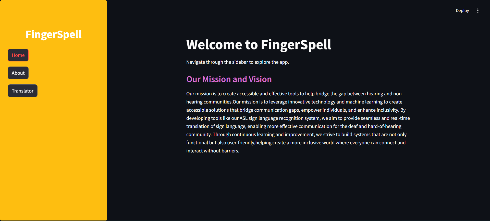
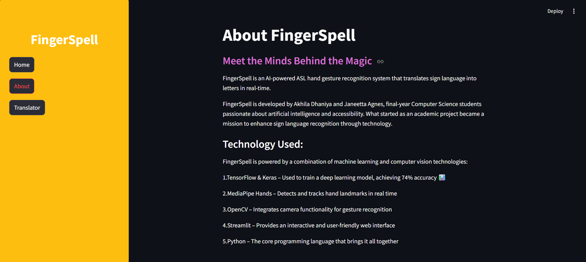
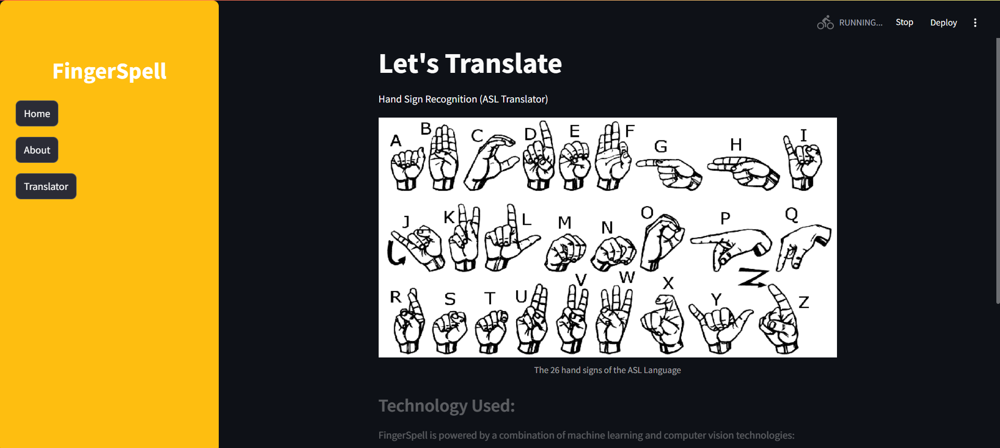
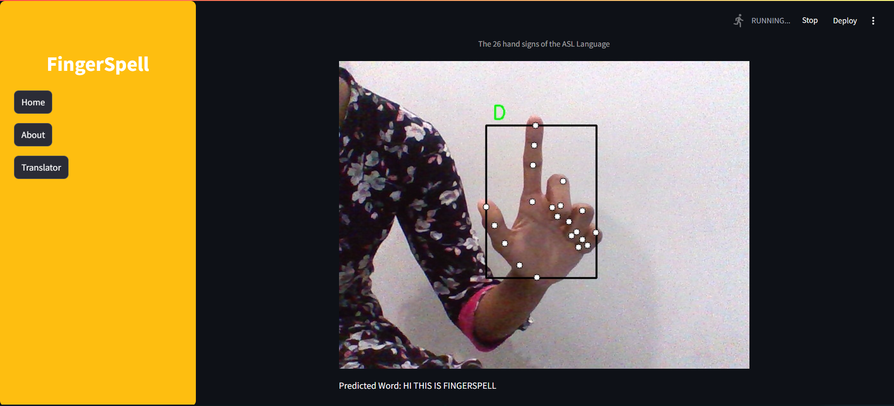

# FingerSpell-An-ASL-Recognition-System

## Directory

<pre>
│  app.py
│  keypoint_classification.ipynb
│  deploy.py
│  
├─model
│  ├─keypoint_classifier
│  │  keypoint.csv
│  │  keypoint_classifier.hdf5
│  │  keypoint_classifier.py
│  │  keypoint_classifier.tflite
│  └─ keypoint_classifier_label.csv
│          
└─utils
    └─cvfpscalc.py
</pre>

### app.py
This is a sample program for inference. 
In addition, learning data (key points) for hand sign recognition, 
You can also collect training data (index finger coordinate history) for finger gesture recognition.

### keypoint_classification.ipynb
This is a model training script for hand sign recognition.

### model/keypoint_classifier
This directory stores files related to hand sign recognition. 
The following files are stored.
* Training data(keypoint.csv)
* Trained model(keypoint_classifier.tflite)
* Label data(keypoint_classifier_label.csv)
* Inference module(keypoint_classifier.py)

## Application Preview
### Homepage

### About

### Capture Gestures

## Requirements
* mediapipe 0.8.1
* OpenCV 3.4.2 or Later
* Tensorflow 2.3.0 or Later tf-nightly 2.5.0.dev or later (Only when creating a TFLite for an LSTM model)
* scikit-learn 0.23.2 or Later (Only if you want to display the confusion matrix) 
* matplotlib 3.3.2 or Later (Only if you want to display the confusion matrix)
