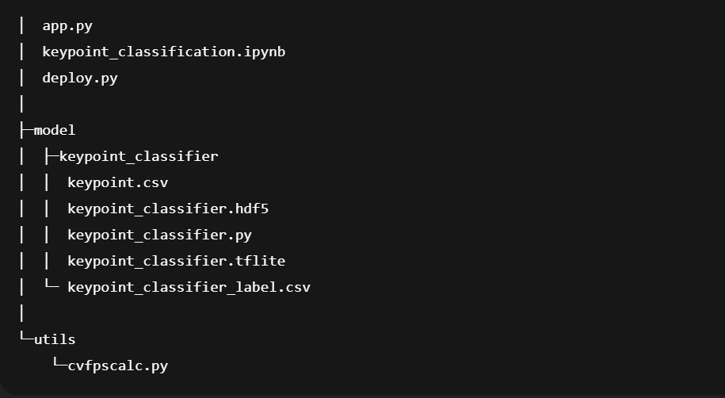

# FingerSpell-An-ASL-Recognition-System

# Directory

## app.py

Collect training data (hand coordinate history) for gesture recognition.

## keypoint\_classification.ipynb

This is a model training script for hand sign recognition.

## model/keypoint\_classifier
=======
## keypoint_classification.ipynb

This is a model training script for hand sign recognition.

## model/keypoint_classifier
>>>>>>> 8ea1b4e8a0de849e3adb82ff87f880a7e8f4fda7

This directory stores files related to hand sign recognition.
The following files are stored.

1.Training data(keypoint.csv)
<<<<<<< HEAD
2.Trained model(keypoint\_classifier.tflite)
3.Label data(keypoint\_classifier\_label.csv)
4.Inference module(keypoint\_classifier.py)

=======
2.Trained model(keypoint_classifier.tflite)
3.Label data(keypoint_classifier_label.csv)
4.Inference module(keypoint_classifier.py)
>>>>>>> 8ea1b4e8a0de849e3adb82ff87f880a7e8f4fda7
